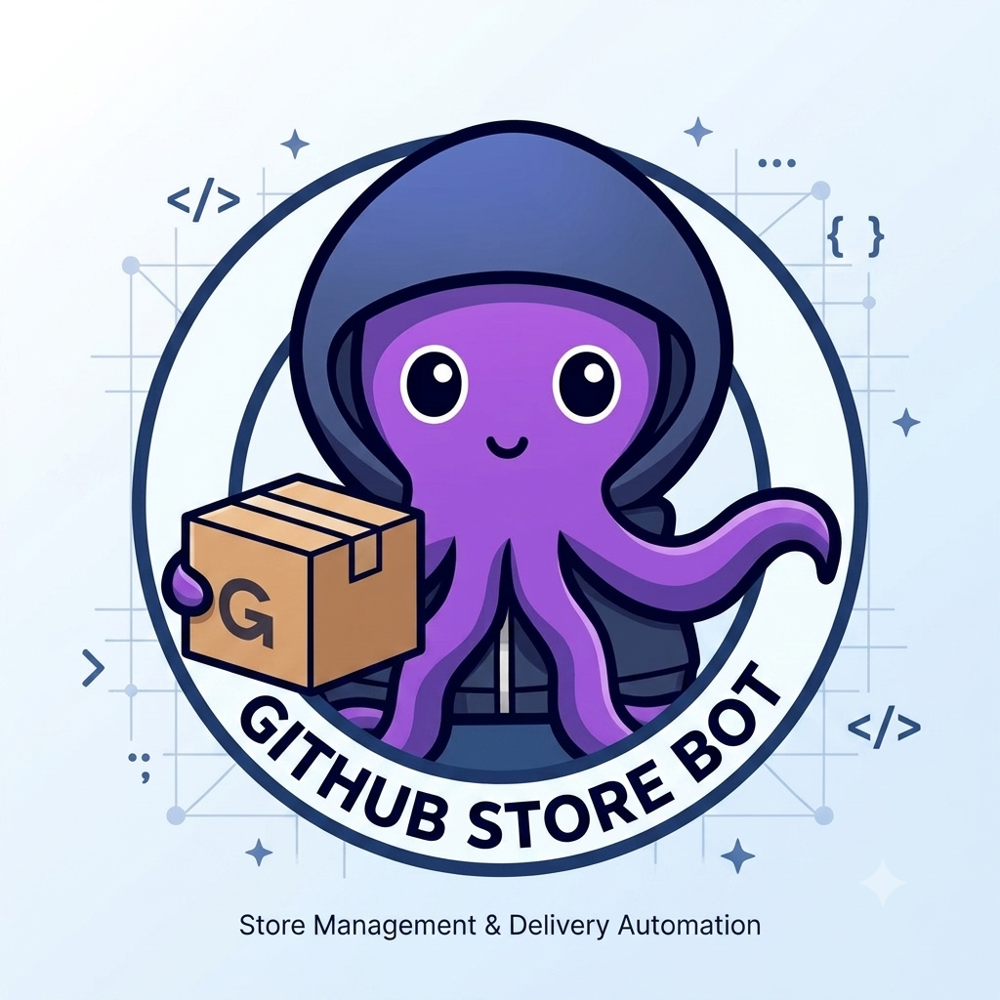

<p align="center">
  
</p>

<h1 align="center">GitHub Store Bot</h1>

<p align="center">
  <b>متجر التطبيقات مفتوحة المصدر داخل تيليجرام</b><br>
  <i>ابحث، استكشف، وحمّل Releases من GitHub بضغطة واحدة</i>
</p>

<p align="center">
  
  
  
  
  
  
  
  
</p>

<p align="center">
  <a href="#-المميزات">المميزات</a> •
  <a href="#-الية-عمل-البوت">آلية العمل</a> •
  <a href="#-التثبيت-والتشغيل">التثبيت</a> •
  <a href="#-النشر-على-railway">النشر</a> •
  <a href="#-لوحة-التحكم-dashboard">الداشبورد</a> •
  <a href="#-الأمان">الأمان</a> •
  <a href="#-الأوامر">الأوامر</a>
</p>

---

## 🖼️ لمحة عن المشروع

**GitHub Store Bot** هو بوت تيليجرام متكامل يتيح للمستخدمين البحث عن التطبيقات مفتوحة المصدر على GitHub واستكشاف مستودعاتها وعرض إصداراتها المتاحة (Releases) وتحميل الملفات مباشرة داخل المحادثة. الفكرة مستوحاة من مشروعَي [**Komi Store**](https://github.com/kurikomi-labs/komi-store) و [**OpenHub Store**](https://github.com/OpenHub-Store/GitHub-Store) الرائدين في هذا المجال، مع إعادة بناء التجربة بالكامل لتلائم بيئة التليجرام مع واجهة تفاعلية سلسة مبنية على الأزرار الشفافة ورسائل التحديث الذاتية.

> 🤝 **شكر خاص لفريق [kurikomi-labs](https://github.com/kurikomi-labs)** على إلهامهم المتميز وإسهاماتهم القيّمة في مجال متاجر التطبيقات مفتوحة المصدر.

---

## ✨ المميزات

### 🔍 بحث ذكي متعدد الأنماط
- **بحث بالاسم**: `/search termux` — يستخدم GitHub Search API للعثور على أفضل النتائج مرتبة حسب النجوم
- **بحث بالمسار**: `/search termux/termux-app` — انتقال مباشر للمستودع
- **بحث بالرابط**: الصق أي رابط GitHub وسيتم التعرف عليه تلقائياً
- **فلترة تلقائية**: النتائج تُفلتر لإظهار المستودعات التي تحتوي على Releases فقط

### 🤖 واجهة تفاعلية (Inline Buttons UX)
- **رسائل ذاتية التحديث**: كل المراحل تتم في رسالة واحدة تتحدث تلقائياً (لا رسائل مزعجة)
- **رحلة التحميل بخطوات**:
  ```
  بحث → نتائج المستودعات → اختيار المستودع
  → قائمة الإصدارات → اختيار إصدار
  → قائمة الملفات → تحميل مباشر
  ```
- **أزرار التنقل**: رجوع للإصدارات، رجوع للملفات، رجوع للقائمة الرئيسية
- **لا أوامر مطلوبة بعد البحث الأول**: كل شيء بالأزرار

### 📦 عرض شامل للمستودعات
- وصف المستودع، عدد النجوم، الفوركات، اللغة البرمجية، الرخصة
- قائمة بآخر 10 إصدارات مع تواريخها وعدد الملفات
- تمييز الإصدارات التجريبية (Beta/Pre-release)
- عرض حجم كل ملف وعدد مرات التحميل

### 📥 تحميل ذكي
- **ملفات ≤ 49MB**: تُحمَّل وتُرسل كوثيقة داخل التليجرام مباشرة
- **ملفات > 49MB**: زر شفاف برابط تحميل مباشر من سيرفرات GitHub
- **تراجع ذكي**: إذا فشل رفع الملف لأي سبب، يُرسل رابط بديل تلقائياً
- **مؤشر التقدم**: رسالة "جاري التحميل..." تظهر أثناء المعالجة

### 🔐 نظام مصادقة GitHub
- **تحقق فوري**: عند `/login` يتم التحقق من صلاحية التوكن عبر GitHub API قبل حفظه
- **عرض الحالة**: `/login` بدون توكن يعرض حالة الربط الحالية (متصل/غير متصل/توكن غير صالح)
- **تشفير AES-128**: التوكنات تُشفّر بـ Fernet قبل حفظها في قاعدة البيانات
- **رفع الحد**: من 10 طلبات/دقيقة إلى 5000 طلب/ساعة عند الربط

### 🌐 وضعان للتشغيل
| الوضع | الاستخدام | الميزة |
|-------|-----------|--------|
| **Polling** | التشغيل المحلي والتطوير | لا يحتاج رابط عام |
| **Webhook** | النشر على Railway/الخوادم | أكثر كفاءة واستقراراً |

### 📊 لوحة تحكم (Dashboard)
- لوحة مراقبة مدمجة لعرض إحصائيات المستخدمين والبحث والتحميل
- محمية بكلمة مرور Admin
- تعمل على نفس منفذ البوت

---

## 🔄 آلية عمل البوت

```
┌─────────────────────────────────────────────────────────┐
│                    المستخدم في التليجرام                    │
│                                                         │
│  /search termux  ──→  🔍 GitHub Search API              │
│                        │                               │
│                        ▼                               │
│               ┌─────────────────┐                      │
│               │ فلترة المستودعات │  (إظهار التي تحتوي  │
│               │ ذات Releases فقط │   على إصدارات فقط)   │
│               └────────┬────────┘                      │
│                        ▼                               │
│         [📦 termux/termux-app]  (زر شفاف)              │
│                        │                               │
│                        ▼                               │
│         GitHub API: repos/{owner}/{repo}                │
│         + repos/{owner}/{repo}/releases                 │
│                        │                               │
│                        ▼                               │
│         وصف المستودع + قائمة الإصدارات (أزرار)          │
│                        │                               │
│                        ▼                               │
│         [🏷️ v0.120.0]  →  قائمة الملفات               │
│                        │                               │
│                        ▼                               │
│         [📥 app-arm64.apk]  →  تحميل + إرسال           │
└─────────────────────────────────────────────────────────┘
```

### تدفق البيانات:
1. **المستخدم** يرسل `/search <query>` أو يضغط زر البحث
2. **البوت** يحوّل الرسالة إلى "جاري البحث..." (تحديث ذاتي)
3. **إذا نص عادي**: يبحث عبر `GET /search/repositories?q={query}` ويُفلتر النتائج
4. **إذا مسار أو رابط**: ينتقل مباشرة لجلب معلومات المستودع
5. **يُعرض** المستودع/النتائج كأزرار شفافة في نفس الرسالة
6. **المستخدم** يتنقل بالأزرار: مستودع → إصدار → ملف
7. **عند اختيار ملف**: يُحمَّل ويُرسل كوثيقة، أو يُرسل رابط مباشر

---

## 📁 هيكل المشروع

```
github-store-bot/
├── assets/
│   └── logo.png                 # شعار المشروع
├── bot/
│   ├── __init__.py
│   ├── config.py                # إعدادات التهيئة (متغيرات البيئة)
│   ├── crypto.py                # تشفير/فك تشفير التوكنات (Fernet/AES)
│   ├── database.py              # إدارة قاعدة البيانات (SQLite) + الإحصائيات
│   ├── github_api.py            # التواصل مع GitHub API (بحث، releases، تحميل)
│   ├── webhook_server.py        # خادم Webhook + لوحة التحكم (FastAPI)
│   └── handlers/
│       ├── __init__.py
│       ├── commands.py          # أوامر /start و /help
│       ├── auth.py              # /login و /logout مع التحقق من الصلاحية
│       ├── search.py            # /search وكل مراحل عرض النتائج والتحميل
│       └── callbacks.py         # موجّه الأزرار الشفافة
├── main.py                      # نقطة الدخول الرئيسية (Polling / Webhook)
├── Dockerfile                   # صورة Docker محسّنة للنشر
├── railway.json                 # إعدادات Railway التلقائية
├── Procfile                     # أمر التشغيل
├── requirements.txt             # المكتبات المطلوبة
├── .env.example                 # قالب متغيرات البيئة
├── .gitignore
├── LICENSE                      # رخصة MIT
└── README.md
```

---

## 💻 التثبيت والتشغيل محلياً

### المتطلبات
- Python 3.11 أو أحدث
- حساب على [t.me/BotFather](https://t.me/BotFather) للحصول على توكن البوت

### الخطوات

```bash
# 1. استنساخ المشروع
git clone https://github.com/YOUR_USERNAME/github-store-bot.git
cd github-store-bot

# 2. إنشاء بيئة افتراضية
python -m venv venv
source venv/bin/activate        # Linux/macOS
# venv\Scripts\activate         # Windows

# 3. تثبيت المكتبات
pip install -r requirements.txt

# 4. إعداد متغيرات البيئة
cp .env.example .env
# عدّل الملف .env وأضف قيمك

# 5. تشغيل البوت (وضع Polling)
python -m main
```

### متغيرات البيئة المطلوبة

| المتغير | الوصف | مثال |
|---------|-------|------|
| `TELEGRAM_BOT_TOKEN` | توكن البوت من @BotFather | `8914868684:AAH...` |
| `ENCRYPTION_KEY` | مفتاح تشفير (أي نص عشوائي) | `python -c "import secrets; print(secrets.token_urlsafe(32))"` |
| `BOT_MODE` | وضع التشغيل | `polling` (محلي) أو `webhook` (إنتاجي) |

---

## 🚀 النشر على Railway

### الطريقة الموصى بها: عبر GitHub

1. **ارفع المشروع على GitHub** وادفعه إلى الفرع `main`

2. **أنشئ مشروع جديد على [Railway](https://railway.com)**:
   - `New Project` → `Deploy from GitHub repo` → اختر المستودع

3. **أضف متغيرات البيئة** في `Variables`:

   | المتغير | القيمة | مطلوب؟ |
   |---------|--------|--------|
   | `TELEGRAM_BOT_TOKEN` | توكن البوت | ✅ |
   | `ENCRYPTION_KEY` | نص عشوائي طويل | ✅ |
   | `BOT_MODE` | `webhook` | ✅ |
   | `WEBHOOK_URL` | `https://xxx.up.railway.app/webhook` | ✅ |
   | `WEBHOOK_SECRET` | نص عشوائي | 🔐 مؤكد |
   | `ADMIN_PASSWORD` | كلمة مرور الداشبورد | 🔐 مؤكد |
   | `LOG_LEVEL` | `INFO` | اختياري |

4. **أضف Volume**: `Settings` → `Volumes` → Mount Path: `/data`

5. **فعّل Public Networking**: `Settings` → `Networking` → `Public` ✅

6. **حدّث `WEBHOOK_URL`** بالرابط العام الناتج ثم أعد النشر

### عبر Railway CLI

```bash
npm install -g @railway/cli
railway login && railway init

railway variables set TELEGRAM_BOT_TOKEN="your_token"
railway variables set ENCRYPTION_KEY="$(python3 -c 'import secrets;print(secrets.token_urlsafe(32))')"
railway variables set BOT_MODE="webhook"
railway variables set WEBHOOK_URL="https://xxx.up.railway.app/webhook"
railway variables set ADMIN_PASSWORD="your_admin_pass"

railway volume create /data
railway up
```

---

## 📊 لوحة التحكم (Dashboard)

لوحة مراقبة مدمجة في خادم البوت لمراقبة الأداء والمستخدمين والإحصائيات.

### الوصول
```
https://your-app.up.railway.app/admin
```
> كلمة المرور: قيمة متغير `ADMIN_PASSWORD`

### الميزات
- 📈 إحصائيات شاملة: المستخدمين، عمليات البحث، التحميلات، الأخطاء
- 👥 قائمة المستخدمين المسجلين مع حالة الربط
- 🔍 سجل عمليات البحث الأخيرة
- 📥 سجل التحميلات الأخيرة
- 📊 رسوم بيانية تفاعلية (Chart.js)

---

## 🛡️ الأمان

### حماية متعددة الطبقات

| التهديد | الحماية |
|---------|---------|
| **RCE (تنفيذ أوامر)** | لا يوجد أي `exec` أو `eval` أو `subprocess` — جميع العمليات عبر httpx و SQL parameterized |
| **SQL Injection** | جميع استعلامات SQLite تستخدم `?` placeholders (parameterized queries) |
| **XSS** | الداشبورد يُرسل البيانات كـ JSON API فقط، لا HTML مُدخل من المستخدم |
| **تسريب التوكنات** | تُشفّر بـ AES-128 (Fernet) قبل الحفظ، ولا تُعرض أبداً في السجلات |
| **Webhook مزيف** | `WEBHOOK_SECRET` يتحقق من توقيع Telegram لكل طلب |
| **تعدد المستخدمين** | كل مستخدم معزول بـ `user_id`، لا تشارك للبيانات أو السياق |
| **Brute Force** | كلمة مرور الداشبورد تُتحقق عبر hashing (bcrypt) |
| **Rate Limiting** | GitHub API تُحدّد الطلبات، والبوت يحترم حدودها |
| **بيئة الإنتاج** | جميع الأسرار في متغيرات البيئة فقط، لا شيء في الكود |

### تعدد المستخدمين بأمان
- كل مستخدم يحصل على `user_data` خاص به (معزول في python-telegram-bot)
- التوكنات مشفرة ومفصولة بـ `user_id` في قاعدة البيانات
- لا يوجد أي共享 state بين المستخدمين

---

## ⚙️ الأوامر

| الأمر | الوصف |
|-------|-------|
| `/start` | القائمة الرئيسية مع أزرار التصفح |
| `/help` | دليل الاستخدام الكامل |
| `/search <query>` | بحث (اسم، مسار، أو رابط) |
| `/login` | عرض حالة الربط الحالية |
| `/login <token>` | ربط حساب GitHub مع تحقق فوري |
| `/logout` | إلغاء ربط الحساب |

---

## 🛠️ التقنيات المستخدمة

| التقنية | الاستخدام |
|---------|-----------|
| [Python 3.12](https://python.org) | لغة البرمجة الرئيسية |
| [python-telegram-bot 21+](https://github.com/python-telegram-bot/python-telegram-bot) | مكتبة التليجرام (غير متزامنة) |
| [FastAPI](https://fastapi.tiangolo.com) + [Uvicorn](https://www.uvicorn.org) | خادم Webhook والداشبورد |
| [httpx](https://www.python-httpx.org) | طلبات HTTP غير متزامنة لـ GitHub API |
| [aiosqlite](https://aiosqlite.omnilib.dev) | قاعدة بيانات SQLite غير متزامنة |
| [cryptography](https://cryptography.io) | تشفير Fernet (AES-128-CBC) |
| [Chart.js](https://www.chartjs.org) | رسوم بيانية في الداشبورد |

---

## 📄 الرخصة

هذا المشروع مرخص تحت رخصة [MIT](LICENSE).

---

<p align="center">
  <b>التطوير والبناء: <a href="https://t.me/IIDZII">@IIDZII</a></b><br>
  <sub>فكرة مستوحاة من <a href="https://github.com/kurikomi-labs/komi-store">Komi Store</a> و <a href="https://github.com/OpenHub-Store/GitHub-Store">OpenHub Store</a></sub>
</p>
